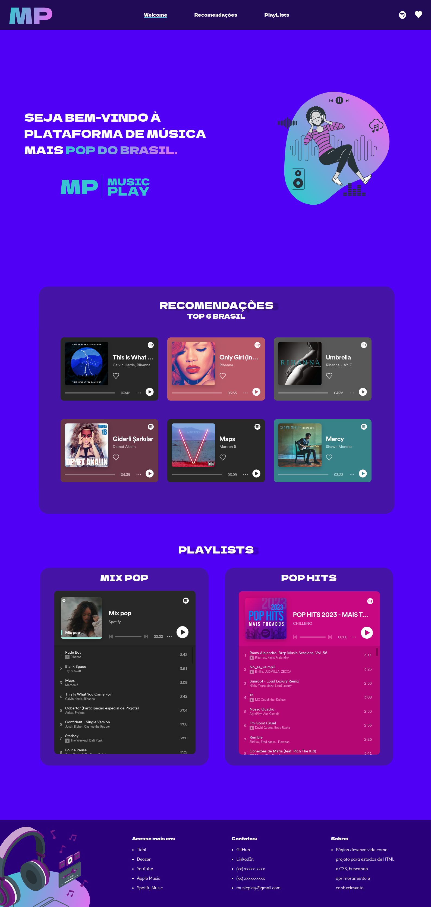

<h1 align="center">MusicPlay</h1>

Web Site: MusicPlay. Utilizando iframes do Spotify, com finalidade de aprimorar meus conhecimentos. 
 

  <h2>🏠 Home </h2>
  

## 🚀 Tecnologias

Esse projeto foi desenvolvido com as seguintes tecnologias:

-  Figma
-  HTML
-  CSS
-  JavaScript
-  Git e Github
-  Vercel

## 🖱 Página publicada

-https://anacaasilva.github.io/MusicPlay/
-https://music-play-rouge.vercel.app/